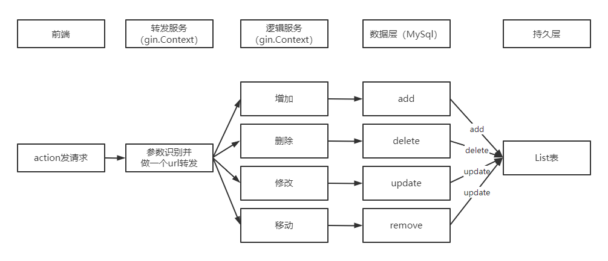

## 需求描述
v1.0: 做一个单人的线上todo list后端，要求使用gin框架，todo list支持移动，增加，删除，修改，并做成微服务
v1.0只需要做两个微服务，一个是gateway，作为所有后端服务的入口，进行服务转发，另一个为todolist服务，实际逻辑在这里实现
## 技术选型
路由框架：gin
数据库：mysql
语言：go 1.17.1
## 增量需求
gateway转发服务
> 路由是利用各种路由算法，获取到目的节点（或目的网络）的路径，生成路由表。
> 转发是路由器收到一个包之后，根据路由表的内容，将包发送出去。

- [ ] 转发入口api(GET)  : HTTP解析->RPC

TODOList服务：

- [ ] 增加api(POST)：/localhost:443/list/add  {id:id,detail:detail,deadline:deadline,author:author,priority:priority}
- [ ] 删除api(GET)：/localhost:443/list/delete?id=id
- [ ] 修改api(POST)：/localhost:443/list/update{id:id require,detail:detail,deadline:deadline,author:author,priority:priority}
- [ ] 移动api(POST)：/localhost:443/list/remove{id:id,priority:priority}

需要restful设计
## 微服务设计
### 前端服务
由king负责
每一个icon或action会bind一个api，对应服务端请求
### 服务端服务
所有http请求都经过gateway服务进行转发，目前默认固定转发到TODOList服务

## 系统设计
服务器：43.132.165.73
端口号：443（转发服务）、rpc（逻辑服务）
系统：Linux
部署待考察
## 排期

- 3.14-3.20  技术调研、形成技术文档、排期（小步慢跑 ，写一个就提交，保证模块化解耦性）
- 3.21-3.25  继续调研：git学习、创建一个仓库、代码规范学习、RPC学习
- 3.26-3.27  建仓库目录、提交文档
- 3.28-4.03  写gateway服务，学习单测
- 4.04-4.10  写逻辑层，调试，review，合入master
- 4.11-4.17  写持久层，调试，review，合入master
- 4.18-4.24  联调，合入master，部署 

